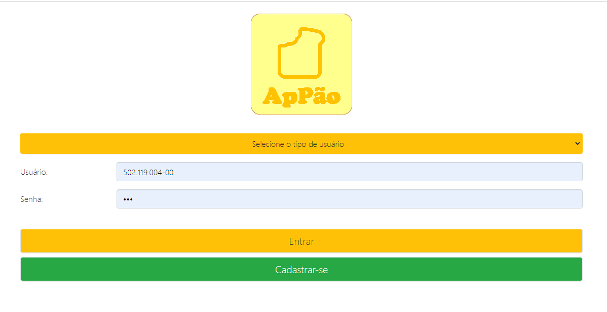

# Delivery para padarias
> Sistema desenvolvido para aprendizado na graduação
> Sistema de delivery para padarias. No sistema o cliente faz o pedido de seu pão pela internet, com notificações para o cliente e para o estabelecimento.



## Ferramentas

PHP:

```sh
7.0
```

MySQL:

```sh
5.1.3
```

JavaScript:

```sh
ECMAScript 5
```

Bootstrap:

```sh
4.0
```

CSS:

```sh
3.0
```

HTML:

```sh
5.0
```
